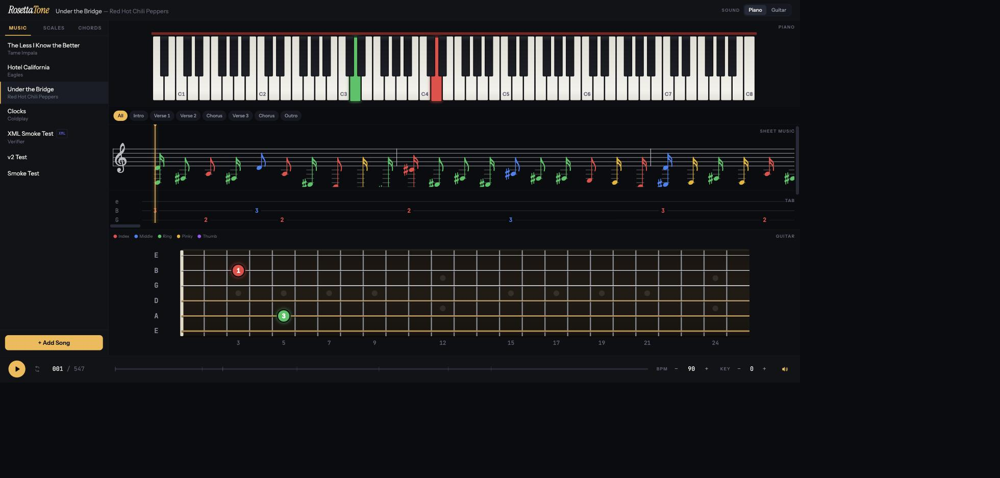
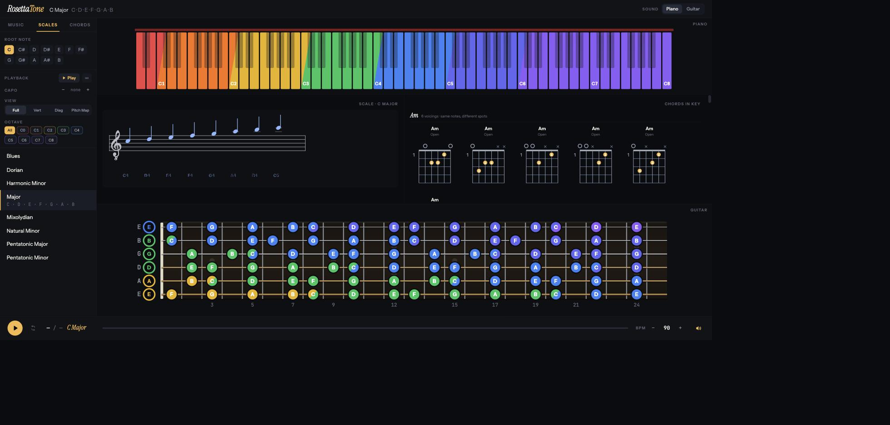

# RosettaTone

**A browser-based music-theory companion that translates one score into four synchronized views — guitar tab, sheet music, fretboard, and piano.**

Load a song and watch it light up simultaneously as staff notation, ASCII tab, dots on the fretboard, and keys on the piano — every note colored by the finger that plays it. Explore scales as CAGED boxes or diagonal runs, hear them traverse the neck, and learn how a chord's voicings map up the strings and onto the keyboard.



*Under the Bridge loaded — piano, engraved staff, tab, and fretboard all synced to the playhead, with song-section pills (Intro / Verse / Chorus / Outro) above the score.*

---

## Why it exists

Guitarists and pianists speak different dialects of the same language. A guitar tab tells you *where to put your fingers* but hides the pitches; sheet music tells you *the pitches* but not where they sit on a neck. RosettaTone keeps every representation on screen at once and in lockstep, so you can read a tab and see the melody on a staff, or watch a scale you know on piano appear as a shape on the fretboard. One internal **Score** model is the Rosetta stone in the middle: tabs come in knowing *where* and get their rhythm inferred; sheet music comes in knowing *when* and gets its fret positions inferred.

## Features

- **Four synchronized views** — sheet music (VexFlow), ASCII tab, 24-fret fretboard, and full 88-key piano, all driven by one playhead
- **Finger-colored notes** — every view colors notes by fretting finger (index/middle/ring/pinky/thumb) so fingering reads at a glance
- **Multi-format ingestion** — paste ASCII tab, drop a **MusicXML** (`.musicxml` / `.xml` / `.mxl`) or **MIDI** file, or scrape a tab URL; a beam-search solver assigns playable fret positions to pitch-only sources
- **Real playback** — sampled acoustic piano & steel guitar (with a synth fallback), drift-free timing, practice-speed control, per-section looping, and BPM / key-shift steppers
- **Capo support** — capo directives in a tab are captured and rendered as a bar on the neck; notes sound at true pitch while tab numerals stay capo-relative
- **Scale Explorer** — 8 scales in any key, shown as **Full**, **Vertical** (CAGED boxes), **Diagonal** (3-notes-per-string), or **Pitch Map** (fretboard aligned in pitch space directly over the keys); ROYGBIV octave-run coloring, an optional scale capo, and press-to-play traversal across neck and keys
- **Chords in key** — every chord that fits the active scale, grouped by name with each voicing labeled by neck position, spelled on a guitar-notation staff
- **Cross-highlight** — hover any note on the fretboard or piano to ring every place that pitch lives on the other instrument



*The Scale Explorer — C major mapped across the whole neck, octave runs colored ROYGBIV on the piano, with chords in key on the right.*

## Tech stack

- **Frontend:** React (Vite) · Tailwind CSS · Zustand · VexFlow · @tonejs/midi · fflate
- **Backend:** Node.js · Express · [sql.js](https://sql.js.org) (pure-JS SQLite — no native compilation)

## Getting started

Requires Node.js. The backend runs on port 4000, the frontend on 3000 (Vite proxies `/api` → backend, so there's no CORS setup in dev).

```bash
# 1. Backend (start first)
cd backend
npm install
npm run dev        # http://localhost:4000

# 2. Frontend (in a second terminal)
cd frontend
npm install
npm run dev        # http://localhost:3000
```

Open **http://localhost:3000** and click a seeded song, or hit **+ Add Song** to paste a tab or drop a MusicXML/MIDI file.

### Keyboard shortcuts

| Key | Action |
| --- | --- |
| `Space` | Play / pause (song or scale, context-aware) |
| `←` / `→` | Step one beat |
| `Home` | Rewind to start |

## Adding songs from a tab URL

RosettaTone treats **Claude Code itself as the scraper** rather than shipping fragile page selectors. Point it at a tab URL and it extracts the title, artist, capo, and ASCII tab, then posts to the API. See [`prompts/process-tab-url.md`](prompts/process-tab-url.md) for the workflow.

## How it works

```
ASCII tab ──tabToScore()────────┐   knows string/fret → infers rhythm
MusicXML ──musicXmlToScore()────┤   knows rhythm → infers string/fret
MIDI ──────midiToScore()────────┘   (fret-inference beam search)
              ↓
   Canonical Score  { meta: {bpm, key, capo, sections…}, events: [...] }
              ↓         (parsed once at ingest, stored as parsed_json)
        scoreToBeats()
              ↓
  Fretboard · Piano · Notation · Tab · Transport   (all subscribe)
```

Architecture, data model, and design-system details live in [`CLAUDE.md`](CLAUDE.md).

## Project status

Localhost-first MVP under active development. Standard EADGBE tuning; treble clef notation. See the "What's Deferred" section of [`CLAUDE.md`](CLAUDE.md) for the roadmap (lyric/chord-symbol strip, Web MIDI input, alternate tunings, and more).
